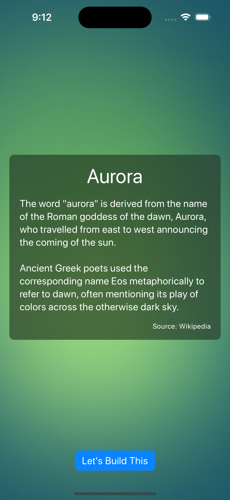

# aurora-animation-swiftui

The Aurora Effect in SwiftUI.

Open the `.xcodeproj` to learn more.

> Note: There is a video of the project but GitHub is not rendering it.

<video id="ss" controls="" muted="" loop="" autoplay="">
  <source src="https://github.com/danielgalasko/aurora-animation-swiftui/blob/main/preview.mov" type="video/mov">
</video>